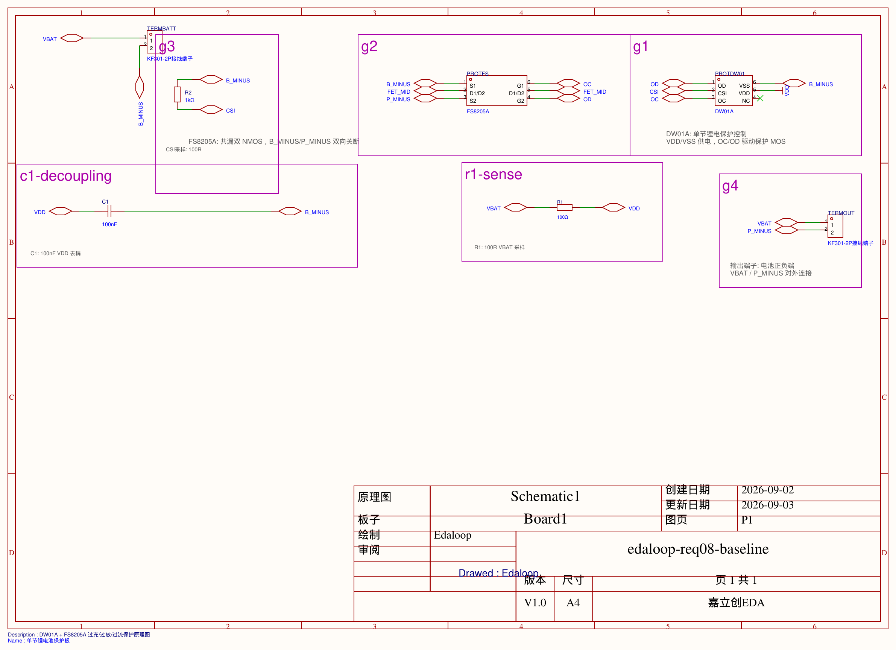
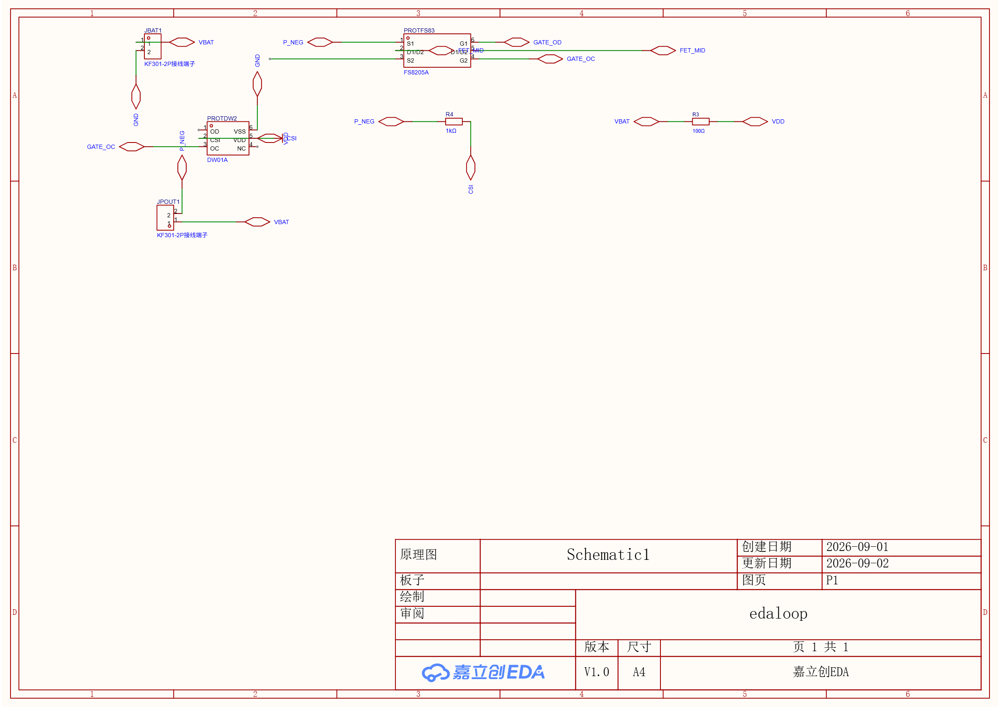
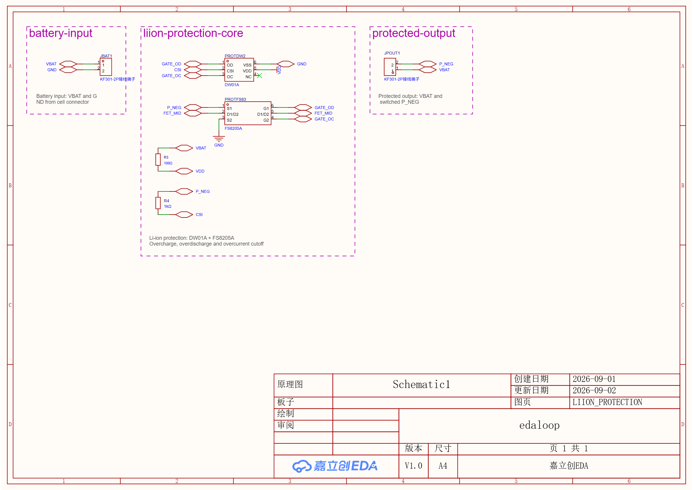

# 天才少年项目申请书:jlc-edaloop —— 让 AI 对电路设计的结果负责

**申请人:郭英涛 | 中国科学院大学 电子信息 硕士二年级 | yingtguo@163.com | 17816600245**
**仓库:https://github.com/Yyin-Tta/jlc-edaloop(已开源)| 日期:2026-09-03**

## 0. 一句话

jlc-edaloop 是一个开源智能原理图设计 agent:读入一句需求,它像工程师一样查手册、翻旧案例、画原理图、过校验、改错误,最终交付带 BOM(立创 C 号)与网表、可直接送厂打样的设计。

## 1. 我要解决什么问题

硬件创造的门槛不在灵感,在「从念头到第一版原理图」这段脏活:选型要翻 datasheet,画图要懂工具,画错了要靠人眼检查。对中学生、创客、甚至专业工程师,这段路都要以天计。

我的判断是:这件事可以拆成「LLM 擅长的部分」(理解需求、检索、规划)和「机器擅长的部分」(确定性落图、机械校验),中间用一个**闭环**焊死——生成的图必须过门禁,不过就归因重试。市面上绝大多数「AI 画原理图」演示止步于生成,不验证、不重试、不留痕;**对结果负责**正是本项目全部架构的出发点。

## 2. 为什么是我

- 中国科学院大学电子信息硕士二年级,研究方向:LLM 工程应用 × 嵌入式硬件。
- 硬件底子来自实战:本科获**中国机器人大赛国家一等奖(冠军)**、**全国大学生电子设计竞赛全国二等奖**;后在杭州八千里机器人实习一年,负责机器人图像采集部分的全栈开发——电路设计、器件选型到驱动联调。
- 深度使用并反哺上游生态:easyeda-agent(Go,CLI/daemon/连接器)重度用户;曾克隆其源码对「连接器假死」做三方定责分析并提交 issue [zhoushoujianwork/easyeda-agent#185](https://github.com/zhoushoujianwork/easyeda-agent/issues/185),另有数枚 issue 候补在写。
- 本项目第一支柱是「开源 + 本地部署」:LLM/embedding 可全换本地端点,设计数据不出域——工程工具应当能进研究所/企业内网,而不是只能活在云端。
- 我的工程习惯:架构决策先写设计文档再动代码(累计 12 项 ADR);23 项风险登记册逐条带触发信号/缓解/兜底;每批结束回写教训;金标准评测只升不降。

## 3. 已经做到哪了(全部可复验)

仓库 2026-08-17 首个提交,半个月 48 次提交迭代至 v0.7.0。数字均出自仓库 README 与可复现的评测:

| 能力 | 现状 |
|---|---|
| 需求→原理图迭代闭环(真机) | 金标需求分层回归(smoke 3/daily 8/rest);曾 22 需求全集 22/22 全 1 轮收敛(布局策略 v2);当前收口布局长尾,硬门禁「本体相交=0」已达 |
| 知识检索(datasheet/案例/块库) | 74 条金标 recall@8 = 93–95%(dense+BM25+型号+rerank 四通道) |
| 电气强门禁 | 注入式评测 10/10 捕获(电压兼容/电流预算/电源轨),0 误杀 |
| 全链贯通 | 「脑洞→原理图→PCB→订单草稿」零手工走通(req-27 展示) |
| 多页布局 | 37 块需求:34 页→7 页,单次 13 分钟 |
| datasheet 入库管道 | 双通道提取+交叉校验(ULN2003A 16/16 脚全对);生产批 10 份 PDF 真机 ingest:5 份过校验入库(105 行电气参数),5 份超模型边界的诚实拒收记 backlog;危险电压探针(24V 直入 8V 耐压充电芯片)DENY 生效 |
| 质量基建 | 476 项离线测试全绿;12 项 ADR + 23 项风险登记册;每轮迭代全量审计日志,`replay` 可按日志重放 |

**复验入口**(任何一条都可现场跑):

```
git clone https://github.com/Yyin-Tta/jlc-edaloop && uv sync && uv run edaloop seed
uv run pytest                                # 全量离线测试
uv run edaloop eval --subset w1-retrieval    # 检索金标
uv run edaloop run evals/showcase/showcase-uln2003.md   # 真机闭环(需 Windows+EasyEDA Pro)
```

审计样例在 `runs/run-<id>/audit.jsonl`:每一轮的意图、检索命中、规划、校验发现、修复动作全量留痕(开发总纲与 runs 不随公开仓分发,随本申请附摘录,可应要求提供全文)。

**附图:最新一次交付(2026-09-03,req-08 锂电管理板,agent 全自动迭代收敛,单页)**



### 3.1 它怎么失败——过程质量的另一面

一个只会报喜的系统不值得信任。这个项目把「诚实失败」做成了机制:

- **拒收而非降标**:datasheet 管道对族级/多封装排版(超出单表提取模型能力)的 5/10 份语料 fail-closed 拒收入库、进 backlog,不用降低校验强度换入库率;
- **未完成不计 PASS**:真机取证中途中断的 run 一律标记 INCOMPLETE_RUN,严禁计入通过统计(该纪律因一次审计缺终态事件而立);
- **发现自己评测器的洞并公开**:断点续跑曾把环境崩溃遗留的失败行当「已完成」跳过,回归门被掏空而不自知——修复为「只跳 PASS」,并写进发版纪律;
- **承认 QA 倒挂**:一批七个外观缺陷全部来自人工目检而门禁全绿——据此建立 14 需求逐页目检审计协议,把目检发现逐类机械化成新门禁,首跑即抓出一个 P0(同引脚同网重复标记);
- **指标自省**:「评分高 ≠ 工程可读」作为正式风险登记(R18),人工抽检因此升为验收必要条件。

**附图:布局修复闭环(2026-09-02 实验前后;上为整页基线、下为修复后保护模块,非同机位 diff)**





## 4. 怎么做的(架构,一段话)

需求文档先编译为结构化意图(DesignIR),歧义处生成「待确认问题」而不是瞎猜;知识层用 sqlite-vec 单文件库做混合检索;生成层分两段——LLM 只负责「规划用哪些电路块」(BlockPlan),落图由确定性编译器执行 typed actions(布局/分页/走线几何全部可算);校验层输出结构化 Finding,强门禁直接拦截、弱门禁进人工确认队列;不通过则归因(REPLAN/RELAYOUT/…)反馈重生成,上限 5 轮、同错 2 轮升级人工。LLM 用 GLM(智谱)、embedding 用 BGE-M3,全部走强制抽象层,可切换任意 OpenAI 兼容端点或本地模型(全离线可跑)。

## 5. 赞助用来做什么(过程导向的分阶段计划)

按官宣「分阶段赞助」设计——**每个阶段独立成立**,即使中途止步,产出也是可交付的开源资产。P1 也不是为申请临时编造的:项目自身路线图的下一步(墙钟 2026-09-15 发 v1.0 后)正是真机取证与实板验证,赞助让它在真板上发生:

| 阶段 | 目标 | 预算 | 产出(无论后续是否继续,均独立有价值) |
|---|---|---|---|
| P1(1–2 月) | **打样实证**:选 3 个金标准需求,agent 全自动生成→送 JLC 打样→回板实测(电源纹波、上电时序、功能项) | ~5,000 | 首份「AI 生成电路 vs 实测」公开报告;fail 案例入库 |
| P2(2–3 月) | 真机评测常态化:分层 evals(easy/medium/hard)每批改动全回归 | ~6,000 | 可复现的回归基线与通过率曲线 |
| P3(持续) | 环境与标准件:测试模块/连接器/易损件,维持真机环境 | ~3,000 | — |
| 机动 | 文档、意外开销 | ~2,000 | — |
| **合计** | | **~16,000** | |

预算大头是 LLM API 与打样,全部开销记账并随月度进展公开。

## 6. 为什么向宇树申请

官宣里王兴兴的故事:一笔约 1 万元的新苗计划资助,让一个用零花钱攒边角料的少年做出了触觉手套。我的路径也始于同一个世界:本科打机器人比赛拿过中国机器人大赛冠军,又用一年时间在机器人公司做图像采集硬件——我深知一款机器人是从一块块子板的原理图长出来的,而「念头→第一版可打样原理图」正是最磨人的一段。本项目在工具层做同一件事:把「有念头、缺资源」的人和他的第一块电路板之间的距离,从几天压到几分钟,而且交付物直接长在嘉立创的制造生态上(带 C 号的 BOM、订单草稿)。如果它长成,机器人团队做衍生子板、学生做毕设原型、创客做第一次尝试,都会多一个顺手的开源工具。我认同过程导向:我会认真记录并公开每一步,包括失败。

## 7. 承诺与责任

- 项目全程开源,阶段进展与开销公开;
- 安全合规责任由本人自行承担(本项目为软件+常规低压电路打样,不涉危险品);
- 如获赞助,接受按阶段核验后拨付。

---

*附件②:《开发总纲摘录》——项目 living document(464 行)的节选,含变更记录与教训集,过程质量的直接证据。*
